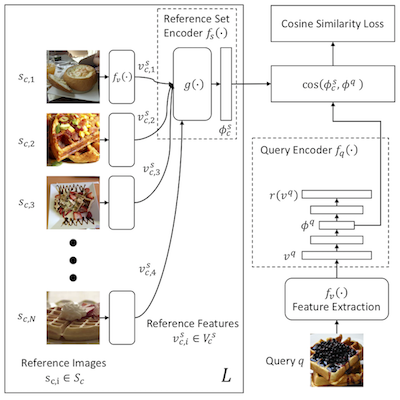
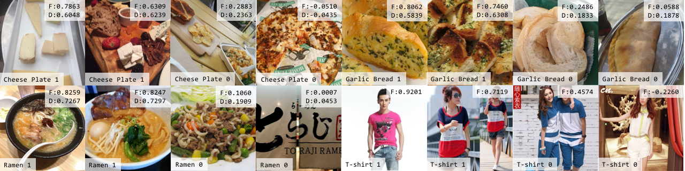

# Introduction
This is CleanNet, the Tensorflow implementation of [CleanNet: Transfer Learning for Scalable Image Classifier Training with Label Noise](https://arxiv.org/abs/1711.07131) ([project page](https://kuanghuei.github.io/CleanNetProject/)) from Microsoft AI and Research. 

## CleanNet
CleanNet is a joint neural embedding network for learning image classification in presence of label noise and label noise detection. To reduce the amount of human supervision for label noise cleaning, it only requires a fraction of the classes being manually verified to provide the knowledge of label noise that can be transferred to other classes.

### Model architecture



### Selected examples of CleanNet predictions
“F” denotes cosine similarity predicted by model using verification labels in all classes. “D” denotes cosine similarity under transfer learning (50/101 classes are excluded for Food-101N, including ramen and garlic bread). Class names and verification labels are shown at bottom-left.




# Citation

If you use the code in your paper, then please cite it as:

```
@inproceedings{lee2017cleannet,
  title={CleanNet: Transfer Learning for Scalable Image Classifier Training with Label Noise},
  author={Lee, Kuang-Huei and He, Xiaodong and Zhang, Lei and Yang, Linjun},
  booktitle={Proceedings of the IEEE Conference on Computer Vision and Pattern Recognition ({CVPR})},
  year={2018}
}
```

# Requirements and Installation
* A computer running macOS, Linux, or Windows
* For training new models, you'll also need a NVIDIA GPU
* `tensorflow` (`1.6`)
* `numpy`
* `opencv-python`

# Quick Start

## Training a New Model


### Prepare Data
CleanNet works on feature vectors. In original paper, we use feature vectors extracted from the pool5 layer of pre-trained ResNet-50 models to represent images. Here, we assume that each image is represented by an h-dimensional feature vector.

For training and validation sets with verification labels, you need to prepare an tsv file for each of them, where the columns are:
[sample key, class name, verification label, h-dimensional feature delimited by ','] or
[sample key, image url, class name, verification label, h-dimensional feature delimited by ','].

For all image samples, including those with and without verification labels, you need to prepare a tsv file, where the columns are:
[sample key, class name, h-dimensional feature delimited by ','] or
[sample key, image url, class name, h-dimensional feature delimited by ','].

You will also need to prepare a text file that lists the unique class names.


### Data Pre-processing
Once you have the required data files, use `util/convert_data.py` to convert each set to a numpy array that can be consumed by CleanNet. For example:
```
Convert train set tsv with verification labels to train.npy:
$ python util/convert_data.py --split=train --class_list={CLASS_LIST} --data_path=${TRAIN} --output_dir={$DATA_DIR}

Convert validation set tsv with verification labels to val.npy:
$ python util/convert_data.py --split=val --class_list={CLASS_LIST} --data_path=${VAL} --output_dir={$DATA_DIR}

Convert all image samples to all.npy:
$ python util/convert_data.py --split=all --class_list={CLASS_LIST} --data_path=${ALL_IMAGE_SAMPLES} --output_dir={$DATA_DIR}
```

Then use `util/find_reference.py` to find reference feature vectors for each category. For example:
```
$ python util/find_reference.py --class_list={CLASS_LIST} --input_npy={$DATA_DIR}/all.npy --output_dir={$DATA_DIR} --num_ref=32 --img_dim=2048
```

### Training and validation
Use `train.py` to train CleanNet and run validation every n step. Here is an example:
```
$ python train.py
    --data_dir=${DATA_DIR} \
    --checkpoint_dir=${MODEL_DIR}/checkpoints/ \
    --log_dir=${MODEL_DIR}/log/ \
    --val_interval=500 \
    --batch_size_sup=32 \
    --batch_size_unsup=32 \
    --val_sim_thres=0.1 \
    --dropout_rate=0.2
```

### Prediction
`inference.py` is for running validation and making predictions.

Use `inference.py` to run validation once using a trained CleanNet model. Here is an example:
```
$ python inference.py \
    --data_dir=${DATA_DIR} \
    --class_list=${CLASS_LIST_FILE} \
    --output_file=${OUTPUT_FILE} \
    --checkpoint_dir=${CHECKPOINT_DIR} \
    --mode=val \
    --val_sim_thres=0.2
```

Use `inference.py` to make predictions. It takes a tsv as input, where the columns are:
[sample key, class name, h-dimensional feature delimited by ','] or
[sample key, image url, class name, h-dimensional feature delimited by ','].
The output is cosine similarity value. Here is an example:
```
$ python inference.py \
    --image_feature_list=${IMAGE_FEATURE_LIST_FILE} \
    --class_list=${CLASS_LIST_FILE} \
    --output_file=${OUTPUT_FILE} \
    --checkpoint_dir=${CHECKPOINT_DIR} \
    --mode=inference
```

# License
Licensed under the MSR-LA Full Rights License [see license.txt]
